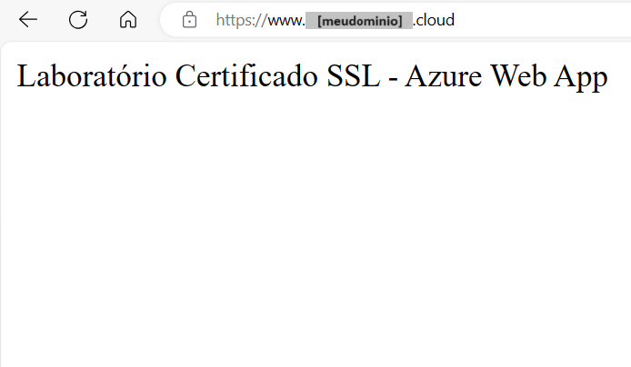

# Configurar um Domínio customizado com Certificado SSL no Azure WebApp

Laboratório demonstrando como configurar um domínio customizado no Azure WebApp, além de apresentar uma forma gratuita de gerar um certificado digital válido para adicionar em seu Azure WebApp.

## Criar uma conta Trial no Azure para finalidade de estudos (opcional)

- $200 para uso durante até 30 dias

Requesitos para criação da conta *Trial*:

- nova conta de E-mail Microsoft (de preferência criada a algum tempo)
- novo número de telefone celular
- novo cartão de crédito

Procedimentos:

- entrar no site para criação da conta usando uma aba anônima
- link: <https://azure.microsoft.com>
- start free > seguir processo de login

## Criação de um Web App para o laboratório

- Resource Group > Create: **rg-lab-001**

- App Services > Create > Web App
  - Name: **app-lab-001** (*o nome do WebApp precisa ser exclusivo*)
  - Publish: Code
  - Runtime stack: .NET (LTS) (*ou outra linguagem a sua escolha*)
  - OS: Windows
  - Pricing Plan: Basic B1
  - Continuou deployment: Disable
  - Enable public access: On
  - Enable Application Insights: No

### Alterar o conteúdo padrão do Web App (opcional)

Testar URL padrão (sem alteração do conteúdo):

- App Service > [app-lab-001] > Overview
  - Default domain: clicar [app-lab-001.azurewebsites.net]

Alterar o conteúdo padrão do Web App

- App Service > [app-lab-001] > App Service Editor > Open Editor:
  - WWWROOT > hostingstart
    - apagar conteúdo padrão
    - digitar novo conteúdo: "Laboratório Certificado SSL - Azure Web App"

Testar novamente URL padrão com conteúdo alterado.

## Criar um Domínio customizado (caso não tenha um)

- Criar um domínio próprio na Hostinger (sugestão):
  - link: <https://www.hostinger.com.br/>

Como referência no laboratório irei chamar o domínio de: "**meudominio.cloud**"

## Gerar um Certificado SSL

Será utilizado um site que gera Certificados SSL gratuitos (sugestão para realização do laboratório).

- Entrar no site: <https://punchsalad.com/ssl-certificate-generator/>
  - Enter domain name(s): meudominio.cloud,www.meudominio.cloud
  - Enter Email: [usar uma conta de Email válida]
  - Validação: DNS
  - Accept: marcar
  - [CREATE FREE SSL CERTIFICATE]
- Após a criação irá abrir a janela **VERIFY DOMAIN**: manter essa janela aberta para o próximo passo

## Verificar o Domínio - criar registros de DNS

- Hostinger > Domínios > "meudominio.cloud" > Gerenciar > DNS/Nameservers > Gerenciar registros DNS
  - Tipo: TXT (*de acordo com a janela "Verify Domains" de criação do Certificado*)
  - Nome: [colar conteúdo a partir da janela "Verify Domains" de criação do Certificado] (*copiar até o "." - não copiar o sufixo*)
  - Valor TXT: [colar conteúdo a partir da janela "Verify Domains" de criação do Certificado]
  - [Add Record]

- Realizar os passo acima para criação do segundo registro para o "www"; nesse caso para o "Nome", copiar conteúdo incluindo ".www" no final.

## Baixar Certificado SSL

- Voltar na janela "Verify Domains" de criação do Certificado* > Domain TXT record
  - 1º registro: [CHECK DNS]
  - 2º registro: [CHECK DNS] (*precisa ter a checagem bem sucedida em ao menos um dos dois registros*)
  - [VERIFY DOMAIN]
  - Download do arquivos do Certificado gerado:
    - [DOWNLOAD CRT + CA BUNDLE]
    - [DOWLOAD PRIVATE KEY]

- Ir na pasta em que os arquivos do Certificado foram salvos
  - os arquivos foram baixados no formato ".txt"
  - **ca-bundle.txt**: alterar extensão desse arquivo para "**.cer**"
  - **private-key.txt**: alterar nome desse arquivo para "**private.key**"

## Converter Certificado SSL para o formato "pfx"

Para importaçaõ do Certificado SSL no Azure, será necessário convertê-lo para o formato "*pfx*". Isso irá criar um certificado seguro, unindo o arquivo do certificado (*.cer*) com a sua chave privada armazenada no arquivo *private.key*.

- Entrar no site: <https://www.sslshopper.com/ssl-converter.html> (sugestão):
  - Certificate File to Convert > [Escolher Arquivo]: selecionar o arquivo "*.cer*"
  - Type of Current Certificate: Standard PEM
  - Type to Convert To: PFX
  - Private Key File: > [Escolher Arquivo]: selecionar o arquivo"*private.key*"
  - PFX Password: [sua_senha_cert] (*definir uma senha simples para o certificado*)
  - [Convert Certificate] (*salvar arquivo .pfx junto aos demais arquivos do certificado*)

## Configurar Domínio Customizado no Azure Web App

- App Service > "app-lab-001" > Custom domains > + Add custom domain
  - Domain provider: All other domain services
  - TLS/SSL certificate: Add certificate later
  - Domain: "meudominio.cloud"
  - Hostname record type: A record  
  (**Verificar o Domínio no Provedor - criar registros de DNS no site do provedor**)
  - Hostinger > Domínios > "meudominio.cloud" > Gerenciar > DNS/Nameservers > Gerenciar registros DNS  
    - Tipo: A (*de acordo com Azure*)
    - Nome: @ (*de acordo com Azure*)
    - Apontar para: [endereço IP indicado no Azure]
    - [Add Record]
    ---
    - Tipo: TXT (*de acordo com Azure*)
    - Nome: asuid (*de acordo com Azure*)
    - Valor TXT: [colar conteúdo indicado no Azure]
    - [Add Record]
  - De volta no Azure *Add custom domain* > clicar em [Validate]
  - Após validação bem sucedida, clicar em [Add]

## Importar Certificado SSL no Azure Web App

- App Service > "app-lab-001" > Certificates > Bring your own certificates (.pfx) > + Add certificate
  - Source: Upload certificate (.pfx)
  - PFX certificate file: selecionar o arquivo "*.pfx*" criado anteriormente
  - Certificate password: [sua_senha_cert] (*digitar a senha definida anteriormente para o certificado*)
  - Certificate friendly name: **cert-app-lab-001**
  - [Validate]
  - Após validação bem sucedida, clicar em [Add]

## Configurar Certificado SSL do Domínio Customizado no Azure Web App

- App Service > "app-lab-001" > Custom domains > "meudominio.cloud" > Add binding
  - Certificate: (*Existing certificates*) [meudominio.cloud,www.meudominio.cloud]
  - TLS/SSL type: SNI SSL
  - [Add]

Testar URL com domínio customizado:

## Configurar Domínio Customizado com "www" no Azure Web App

- App Service > "app-lab-001" > Custom domains > + Add custom domain
  - Domain provider: All other domain services
  - TLS/SSL certificate: Add certificate later
  - Domain: "www.meudominio.cloud"
  - Hostname record type: CNAME  
  (**Verificar o Domínio no Provedor - criar registros de DNS no site do provedor**)
  - Hostinger > Domínios > "meudominio.cloud" > Gerenciar > DNS/Nameservers > Gerenciar registros DNS  
    - Tipo: CNAME (*de acordo com Azure*)
    - Nome: www (*de acordo com Azure*)
    - Objeto: app-lab-001.azurewebsites.net (*sua URL Padrão do Web App*)
    - [Add Record]
    ---
    - Tipo: TXT (*de acordo com Azure*)
    - Nome: asuid.www (*de acordo com Azure*)
    - Valor TXT: [colar conteúdo indicado no Azure]
    - [Add Record]
  - De volta no Azure *Add custom domain* > clicar em [Validate]
  - Após validação bem sucedida, clicar em [Add]

## Configurar Certificado SSL do Domínio Customizado com "www"

- App Service > [app-lab-001] > Custom domains > "www.meudominio.cloud" > Add binding
  - Certificate: (*Existing certificates*) [meudominio.cloud,www.meudominio.cloud]
  - TLS/SSL type: SNI SSL
  - [Add]

Testar URL com domínio customizado usando "www":

## Listagem dos Recursos criados no Azure

Listagem de todos os recursos criados no Azure para execução do Laboratório.

## Links utilizados no laboratório

- Registro de domínio Hostinger: <https://www.hostinger.com.br/>
- Criar Certificado SSL: <https://punchsalad.com/ssl-certificate-generator/>
- Converter certificado para PFX: <https://www.sslshopper.com/ssl-converter.html>

---
Bons estudos!  
***André Carlucci***
